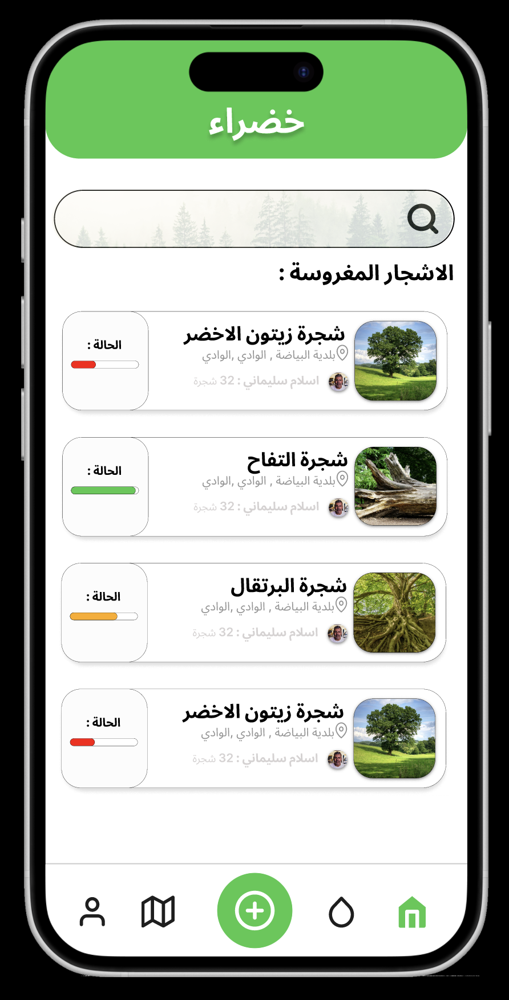

# Task 2: Implement the First UI in view/MainScreen

## Code Explanation

The codebase is structured around the Khadra application using **MVVM Architecture**. Here are the key components:

1. **TreeViewModel**: Handles the business logic related to trees.
2. **MainActivity**: Acts as the entry point of the application.
3. **MainScreen**: Composable that displays the UI, including the list of trees.
4. **TreeRepository**: Acts as a repository for trees.
5. **TreeTypeRepository**: Manages tree type data.
6. **Tree Model & Category Model**: Define the data structure for trees and categories.

## Task

Your task is to implement the first UI in `view/MainScreen` based on the design provided in `FIrstUI.jpg`. The UI should include:

- A list of trees.
- A navigation bar to switch between categories.
- A tree detail view when a tree is selected.
- A search bar to filter trees by name or category.

### Additional Requirements

1. **Add More Trees and Categories**:
   - Add at least 5 more trees and 2 more tree types to the mock data in `TreeRepository.kt` and `TreeTypeRepository.kt`.
   - Ensure the new trees and categories are displayed in the UI.

2. **Implement Search Functionality**:
   - Add a search bar to the top of the `view/MainScreen` UI.
   - Implement functionality to filter the trees list based on the search query (e.g., by tree name or category).

## Instructions

1. Open `view/MainScreen.kt`.
2. Implement the UI layout in `view/MainScreen`.
3. Use the `TreeViewModel` to fetch and display trees.
4. Ensure the UI matches the design in `FIrstUI.jpg`.

## FirstUI

Good luck!
